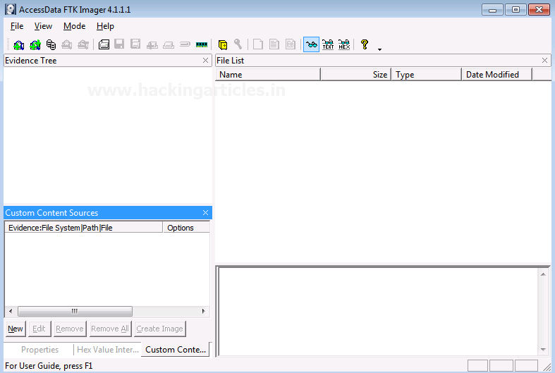
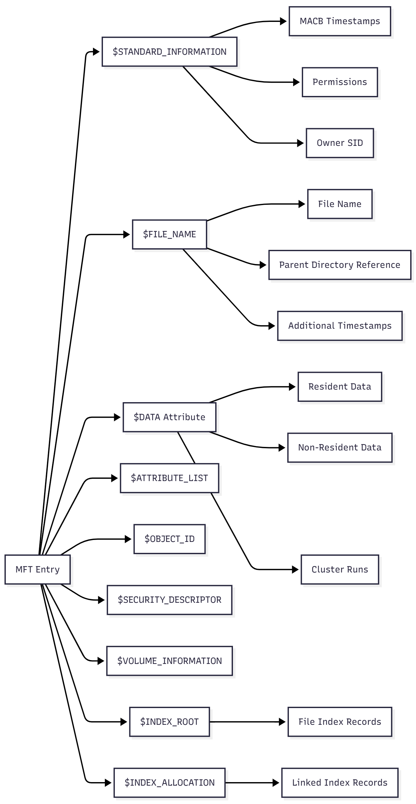
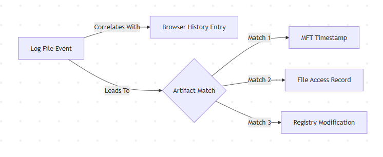

# 🔍 Digital Forensics – Incident Timeline Visualization  
General Case Simulation | Evidence Correlation | Timeline Reconstruction

---

## 📁 1. Overview  
This project simulates a general digital forensics case and demonstrates how to visualize incident timelines, correlate artifacts, and represent evidence relationships using charts, diagrams, and graphs.

---

## 🧩 2. Case Background (Simulated Scenario)
A corporate workstation reported suspicious behavior, including login anomalies, unauthorized file access, and possible data exfiltration.

**Investigation Objectives:**
- Identify event sequence  
- Build a forensic timeline  
- Correlate artifacts  
- Create visual representations for reporting  

---

## 🗂️ 3. Evidence Collected
- System logs (`Event Viewer`)
- Firewall logs  
- Browser history  
- Prefetch files  
- MFT extracted from NTFS  
- Memory snapshot  

**Screenshot Placeholder:**  


---

## 🏗️ 4. Evidence Acquisition Steps

### **4.1 FTK Imager – Logical Acquisition**
Steps:
1. Launch FTK Imager  
2. Select *Create Disk Image*  
3. Choose *Logical Drive / Folder*  
4. Preserve metadata  
5. Generate hash values  

**Screenshot Placeholder:**  


---

## 🧱 5. NTFS Artifact Examination

### **5.1 Master File Table (MFT) Analysis**
Artifacts inspected:
- `$STANDARD_INFORMATION`
- `$FILE_NAME`
- MACB timestamps  
- ADS (Alternate Data Streams)

**Diagram Placeholder:**  


---

## 🕒 6. Timeline Construction (Simulated Data)

### Example Synthetic Events (Replace with real extracted data)
| Timestamp | Artifact | Event Description |
|----------|----------|------------------|
| 2025-04-12 10:14 | Security Log | Failed login attempt |
| 2025-04-12 10:17 | MFT | File accessed: `hr_data.xlsx` |
| 2025-04-12 10:20 | Firewall Log | Outbound connection to unknown IP |
| 2025-04-12 10:26 | Browser History | Downloaded executable |
| 2025-04-12 10:31 | Memory Dump | Suspicious process: `malware.exe` |

---

## 📊 7. Visual Timeline & Graphs

### **7.1 Timeline Chart**
> _Placeholder for timeline graph_


---

### **7.2 Event Frequency Chart**
> _Placeholder for bar graph_


---

### **7.3 Evidence Correlation Graph**
> _Graph to show relationships between artifacts_



---

### **7.4 Network Diagram (Attack Flow)**
> _Placeholder for attacker movement visualization_


---

## 🛠️ 8. Forensic Interpretation

### **8.1 Key Findings**
- Multiple failed login attempts suggest brute force  
- Unauthorized access to sensitive file  
- Suspicious outbound connection pattern  
- Possible execution of malware  
- Exfiltration indicators present  

---

## 🛡️ 10. Conclusion & Recommendations

### ✔️ Summary
- Incident involved unauthorized access and data exfiltration  
- Evidence supports malware execution  
- Lateral movement possible  

### ✔️ Recommendations
- Reset all affected credentials  
- Patch system  
- Apply network monitoring  
- Deploy EDR solution  

---

## 📎 11. Appendix

### **A. Raw Logs (Placeholder)**
```

<SAMPLE LOG BLOCK HERE>
```

### **B. Directory Structure**

```
/graphs
    timeline_placeholder.png
    event_frequency_placeholder.png
/images
    ftk_placeholder.png
    evidence_placeholder.png
/diagrams
    network_attack_flow.png
```

---

## 📢 12. Credits & Tools Used

* FTK Imager
* Autopsy
* Timesketch
* Python visualization
* MFT Parser

